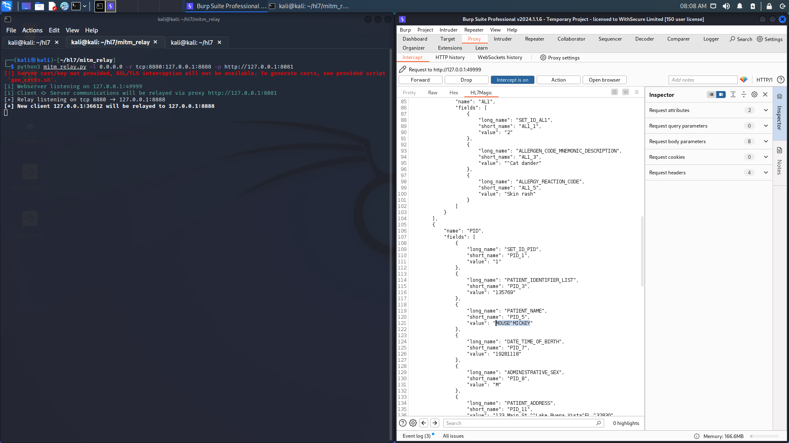

# HL7Magic v0.1

A Burp extension to convert HL7 messages to JSON readable format, to allow for modification when relayed from MitM_Relay.

# Blog post:

https://labs.withsecure.com/publications/hl7magic--a-tool-for-testing-medical-devices-using-the-hl7-proto

# Set-up
Set-up is a little fiddly, but so long as these requirements are in place, you should be good to go.

### Jython
The extension requires Burp Suite to be configured to use Jython. For installation please see:
https://portswigger.net/burp/help/extender.html#options_pythonenv

### Mitm_relay
As HL7 is a non-http protocol, it is expected that a TCP relay tool such as MitM_Relay.py is to be used alongside this extension:
https://github.com/jrmdev/mitm_relay

### HL7apy
The HL7apy Python library is required for this extension, download from here https://github.com/crs4/hl7apy, and run 'python setup.py install'. Make sure the package is located at the system libs: /usr/lib/python2.7/dist-packages. Make sure to point Burp at this package location in the Extender settings.

You will also need to manually compile the .py files within each HL7 version package, so that it works nicely with Jython. For example, running 'python2.7 -m py_compile messages.py' in the /usr/lib/python2.7/dist-packages/hl7apy/v2_5 location if the HL7 message is version 2.5. Each .py module will need to be compiled to .pyc before running the extension. 

### Burp Libraries
Don't forget to install the Burp Extender python libraries: 'pip install burp'.

# Installation

Can be manually installed by cloning this repository and then from within Burp Suite:
1. selecting the Extender tab
2. clicking the Add button
3. changing the Extension type to Python
4. selecting hl7magic.py as the extension file.

